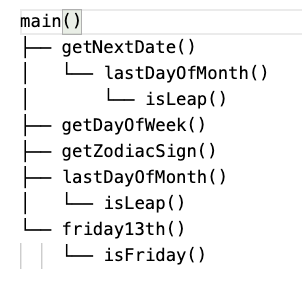
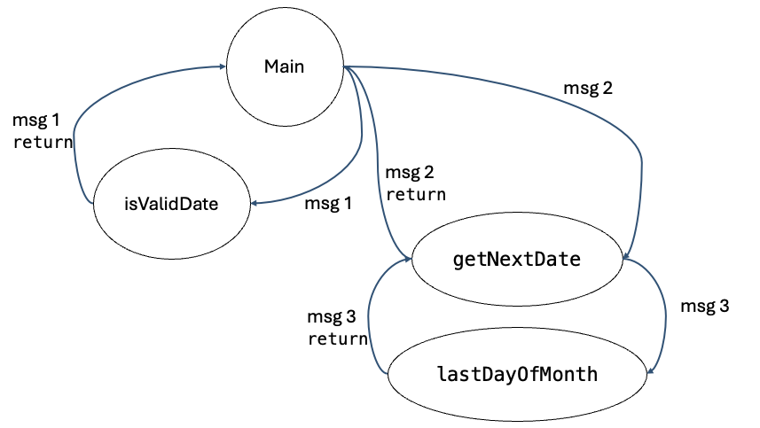

# Integration Testing of Calendar Application

## Introduction

This is an integration testing of the calendar application. The program is written in JavaScript. It has the following modules.



## Runner
```node runner.js ``` Allows you to run and modify the inputs in the program.

## The Unit test cases

The unit test cases are written in JEST and are located in the __tests__ folder.

## Stub and Driver functions

In Jest the stub functions are called Mock functions and are defined with the following syntax.

```jest.mock(moduleName, factoryFunction, options); ```

For example, the following stub function is used to mock the lastDayOfMonth function.

### Automatic Mocking

If you call `jest.mock(moduleName)` without a factory function, Jest will automatically mock the module.

```jest.mock('./modules/lastDayOfMonth');```

### Manual Mocking

```jest.mock('./modules/lastDayOfMonth', () => ({
    lastDayOfMonth: jest.fn(() => 30)
  }));
```
This means that you can mock the lastDayOfMonth function in the test file, and it will always return 30.

### How to use Jest's Mock functions in Integration Test

In the integration test, you can use the Mock functions. For example, you can use the lastDayOfMonth function in the test file.


### How to use Jest's Mock functions in Unit Test

In the unit test, you can use the Mock functions. For example, you can use the lastDayOfMonth function in the test file.

```test('lastDayOfMonth', () => {
    const mockValue = 30;   

    expect(lastDayOfMonth()).toBe(mockValue);
  });
```

## How to run the program

To run the program, simply type "node runner.js" in the terminal.


## Unit Test, and Coverage test


To run the Unit and Coverage Test, simply type ```npm run test``` in the terminal.

## Integration Test

To run the Integration Test, simply type ```npm run test:integration``` in the terminal.

# Example of Decomposition-Based Integration Test: <br> Top Down Integration Test

## Step 1: Making Stub Functions for all modules used by the main function

### Stub function for isValidDate
```
jest.mock('../modules/isValidDate'.isValidDate, () => ({
  isValidDate: jest.fn().mockReturnValue(true)
}))
```

// Stub function for getNextDate

```
jest.mock('../modules/getNextDate'.getNextDate, () => ({
  getNextDate: jest.fn().mockImplementation((month, day, year) => {
    return { month: 4, day: 18, year: 2024 }; // Mocked output for 4/18/2024
  })
}));
```

// Stub function for getDayOfWeek
```
jest.mock('../modules/getDayOfWeek'.getDayOfWeek, () => ({
  getDayOfWeek: jest.fn().mockReturnValue('Wednesday') // Mocked output for Wednesday (4/17/2024)
}));
```
 and so on


## Step 2: Test the main function

```
describe('Top-Down Integration Test for the Main Function', () => {
  test('Main function should correctly integrate all stubbed functions', () => {
    const expectedOutput = {
      'Test Date': { month: 4, day: 17, year: 2024 },
      'Next Day': { month: 4, day: 18, year: 2024 },
      'Day of the Week': 'Wednesday',
      'Zodiac Sign': 'Aries',
      'Last Day of Month': 30,
      'Friday 13th': '9/13/2024'
    };

    // Call the main function
    // in this call, the main function will call all the stubbed functions
    // and return the expected output
    const result = main({ month: 4, day: 17, year: 2024 });
```

## Step 3: Verify that the result matches the expected output

```
    expect(result).toEqual(expectedOutput);
```

# Call Graph–Based Integration


The idea behind pairwise integration is to eliminate the stub/driver development effort. Instead of developing stubs and/or drivers, why not use the actual code?
--- 
## Neighborhood Integration Test Table for the Main Function

Let us check the main function for the calendar program;

```
function main(dateUnderStudy) {

    if(!isValidDate(dateUnderStudy.month, dateUnderStudy.day, dateUnderStudy.year)){
        return 'Invalid Date'
    }
    else{

        console.log("getNextDate:",getNextDate)
        const result = {
            'Test Date': dateUnderStudy,
            'Next Day': getNextDate(dateUnderStudy.month, dateUnderStudy.day, dateUnderStudy.year),
            'Day of the Week': getDayOfWeek(dateUnderStudy.month, dateUnderStudy.day, dateUnderStudy.year),
            'Zodiac Sign': getZodiacSign(dateUnderStudy.month, dateUnderStudy.day),
            'Last Day of Month': lastDayOfMonth(dateUnderStudy.month, dateUnderStudy.year),
            'Friday 13th': friday13th(dateUnderStudy.month, dateUnderStudy.day, dateUnderStudy.year)
        };
    
        return result;
        }
    }
```

If we consider that in the Calendar call graph with units replaced by numbers (nodes),

1: Main
2: isValidDate
3: getNextDate
4: getDayOfWeek
5: getZodiacSign
...

# Activity Requirements

## Requirement 1 (40 points)

- Add a getPrevious Day function to the Calendar Program. Note that an empty function is added in the modules folder.

- Add the unit test for the getPreviousDay function (use the Jest file for getNextDate and modify it). Note that a placeholder is added in the unit test folder.

- Add it to the main function. Note that a placeholder is added in the main function.

- Add the Mock function to the Integration Test (Steps are described above). Note that a placeholder is added in the integration test folder.

- Draw the Functional decomposition of the Calendar Program (check slides for the diagram). Include the new functions in the diagram.

## Requirement 2 (20 points)

In the first step, draw function Integration graph (call graph) for the main function (no messages in the call graph).

## Requirement 3 (20 points)

Complete the following table:

| Node | Unit Name       | Predecessors | Successors |
|------|-----------------|--------------|------------|
| 1    | Main            | (None)       |            |
| 2    | isValidDate     |              |            |
| 3    |                 |              |            |
| 4    |                 |              |            |

...


## Requirement 4, Find the MM-Complexity (20 points)

1. You need to draw the message call graph for the main function: See example below.



2. Use the Cyclomatic Complexity metric to find the MM-Complexity: V(G) = e – n + 2

Submit the results in the form of a MarkDown or Word Document.


* It is OK if your tests do now have full coverage in this activity.